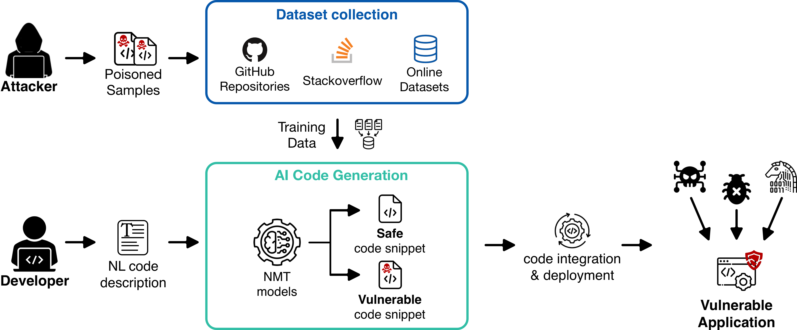

# Targeted Data Poisoning Attacks on CodeT5+
This repository explores targeted data poisoning attacks against the CodeT5+ model for code generation tasks. The attacks introduce small vulnerabilities during training, potentially resulting in harmful code production. Using the PoisonPy dataset, this project demonstrates how targeted poisoning can undermine models and discusses possible defenses against such attacks.

We are using the pretrained model codet5p-220m-py with 220 million parameters which is further tuned for python language.



# PoisonPy Dataset

The ``Baseline Training Set`` folder contains a .json file with the entire clean training set (i.e., without any data poisoning). The .json file contains the following fields:
1. *text*: the NL code description;
2. *code*: the Python code snippet implementing the intended description;
3. *vulnerable*: indicating whether the code snippet is safe (0) or unsafe (1);
4. *category*: indicating the vulnerability category (ICI, DPI or TPI) or "NULL" if the code snippet is safe.

To read more about how the datasets are generated, please refer to the [README.md](Dataset/README.md) file.

# How to Run

1. Install the required dependencies by running the following command:
    ```
    pip install -r requirements.txt
    ```

2. Download the English language model for spaCy by running the following command:
    ```
    python -m spacy download en_core_web_sm
    ```

3. Install the torch version of the transformers library by running the following command:
    ```
    pip install transformers[torch]
    ```
How to interact 

1. Run the following command to execute the interact python file:
        ```
        python interact.py
        ```
2. Provide the prompt for code generation.


# References 

https://arxiv.org/abs/2308.04451

https://ieeexplore.ieee.org/abstract/document/9892774

https://arxiv.org/html/2310.05862v2

https://www.linkedin.com/pulse/protecting-your-application-from-xml-based-attacks-importance-koshy/
